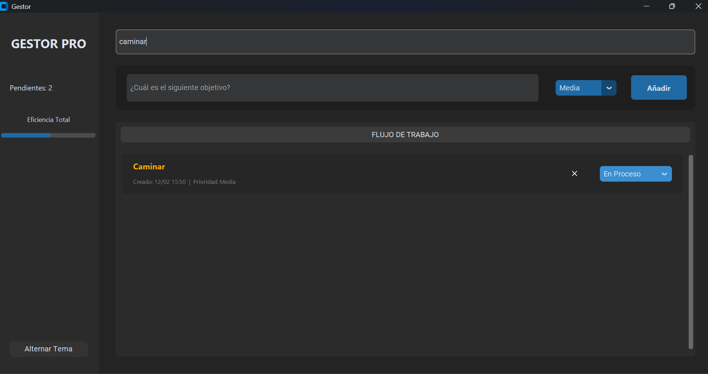
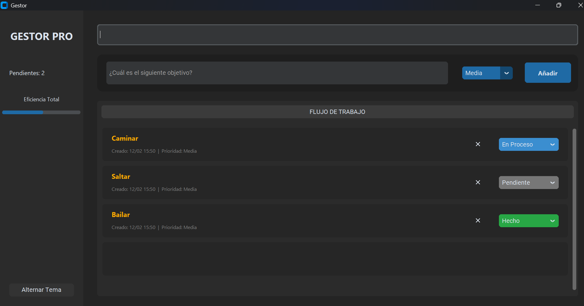
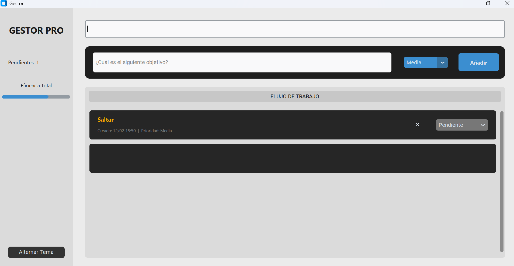

# 🚀 Gestor

  

**Gestor** is a modern desktop application developed in Python for efficient daily task management. This project features a clean user interface, local data persistence, and a workflow optimized for personal productivity.

## 🛠️ Tech Stack
* **Python 3.14**: Core programming language.
* **CustomTkinter**: Modern UI library with native Light/Dark mode support.
* **JSON**: Data persistence system for local storage.

## ✨ Key Features
* **Status Management**: Complete task lifecycle (Pending, In Progress, Done).
* **Smart Prioritization**: Visual organization by urgency levels (High, Medium, Low).
* **Real-time Search**: Dynamic filtering of registered tasks.

### 📊 Workflow & UI

  
  

## 🚀 Installation & Usage
1. **Clone the repository:**
   git clone https://github.com/Jorgeotero1998/Gestor.git
  
2. **Run the application:**

   python main.py

---
Developed with a focus on Clean Code and Modern Desktop Architecture.
